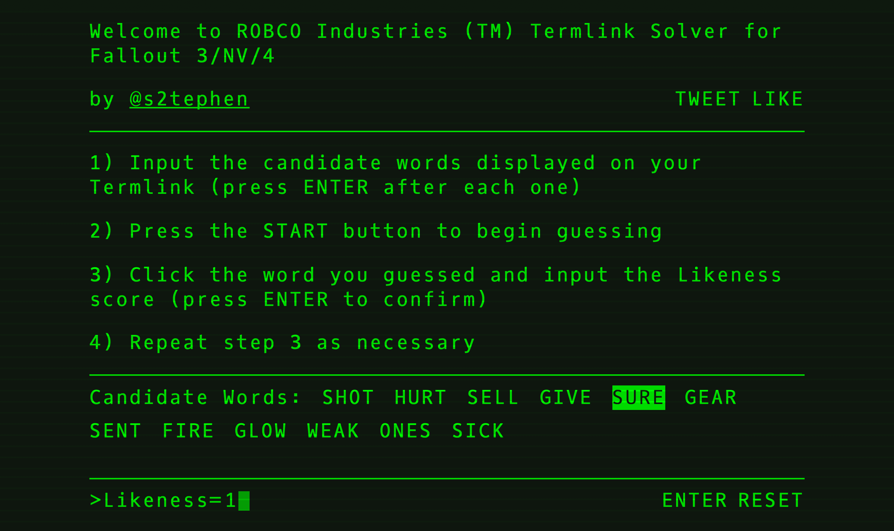

# ROBCO Termlink Solver

Fallout 3/New Vegas/4's dreaded terminal hacking mini-game made easy via a simple web interface. I actually enjoy solving these puzzles since I love Mastermind, but apparently most people just brute-force them. With this tool, input the list of password candidates, enter your guesses (and their corresponding "likeness" scores), and it'll help you figure out the correct answer. This also happens to be Baby's First React Project, so please excuse my S.P.E.C.I.A.L. JavaScript.

### Next steps
* Further compatibility testing/visual tweaks on mobile, which I suspect will be the main use case
* More sophisticated caret behavior (move caret based on selection/cursor position)
* Suggest next guess based on optimal strategy a la [Mastermind](http://mathworld.wolfram.com/Mastermind.html)
* Actually go back to Fallout 4 and beat the main questline
